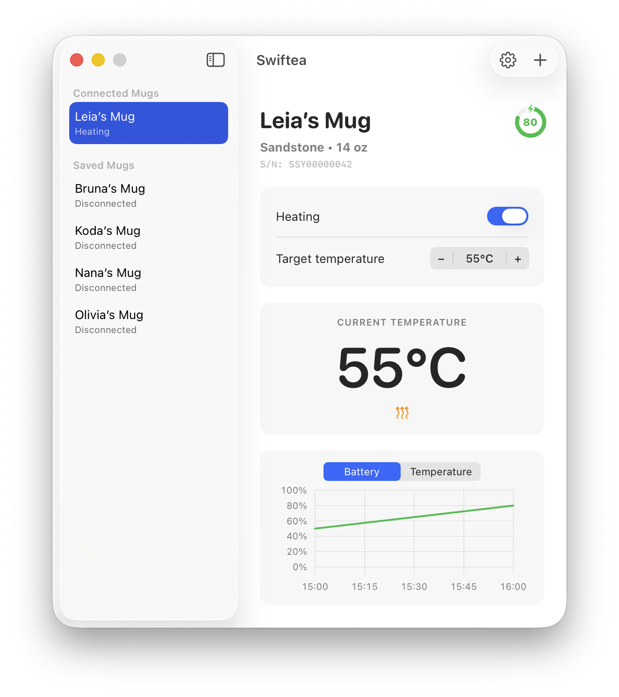

# Swiftea

Swiftea is an unofficial native macOS app for keeping an Ember Mug 2 at the temperature you actually want.

It connects directly to your mug over Bluetooth, lets you set a target temperature, shows battery and current temperature at a glance, and tracks recent battery and temperature history locally.

Swiftea does not use a backend, account system, analytics service, or cloud relay for mug control. Communication happens directly between your Mac and your mug.

<p align="center">
  
</p>

## Status

Swiftea is early software and is currently focused on Ember Mug 2. It may not work with every Ember device, firmware version, or macOS Bluetooth setup.

This project is independent and is not affiliated with, sponsored by, authorized by, or endorsed by Ember Technologies, Inc.

## Features

- Direct Bluetooth control for Ember Mug 2 from your Mac
- Target temperature control with Celsius and Fahrenheit support
- Heating controls that start safely and turn off when the mug is empty
- Battery, charging, and current temperature at a glance
- Local battery and temperature history charts
- Native macOS notifications when your mug reaches target temperature, fully charges, or fully discharges
- Control up to three mugs at the same time
- Per-mug preferences for target temperature and saved names
- Light, dark, and system appearance modes
- Built as a modern native macOS app with Apple frameworks, not a web wrapper

## Requirements

To use Swiftea:

- macOS 26 or later

To build Swiftea:

- Xcode 26 or later
- Swift 6.3 or later
- XcodeGen, if you change `project.yml` or want to regenerate the Xcode project

The canonical Xcode project is `Swiftea.xcodeproj`. The project definition lives in `project.yml`.

## Downloads

Signed and notarized builds are published through [GitHub Releases](https://github.com/tomaspapi/swiftea/releases).

## Build And Run

```zsh
./script/build_and_run.sh
```

To run tests:

```zsh
swift test --scratch-path "${TMPDIR%/}/swiftea-swiftpm-build"
```

## Contributing

Issues and pull requests are welcome. Please keep changes focused, native to macOS, and respectful of the app’s small scope.

Bluetooth behavior can vary by device and firmware. If you report a Bluetooth issue, please include the macOS version, mug model, what you expected to happen, and what actually happened.

## License

Swiftea is released under the [Zero-Clause BSD License (0BSD)](LICENSE).

Prebuilt copies distributed by the maintainer are also covered by Swiftea’s
[Terms of Use](TERMS_OF_USE.md) and [Safety Notice](SAFETY_NOTICE.md). See
the [Privacy Policy](PRIVACY_POLICY.md) for Swiftea’s data practices and
[Acknowledgements](ACKNOWLEDGEMENTS.md) for third-party software and reference material.
